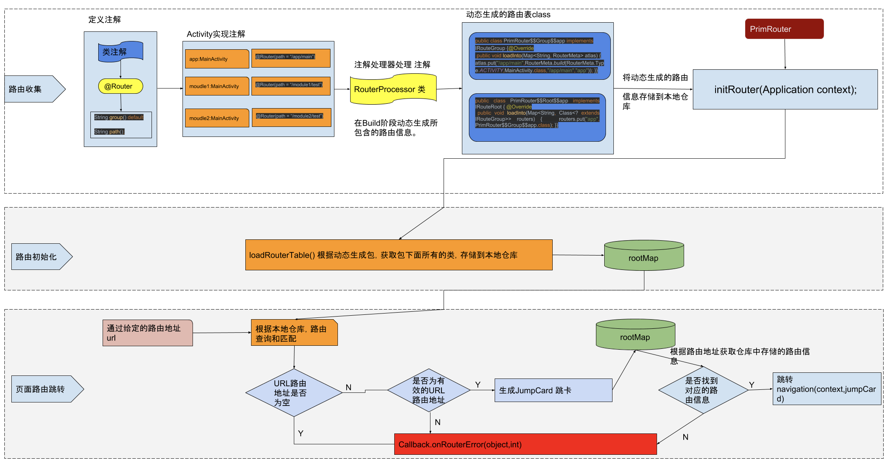

# 自编码实现组件化
* 自编码实现项目组件化，使用路由方式实现。基于Androidx，实现了Activity与Fragment的路由。

### 实现步骤
* 自定义全局配置config.gradle，配置各项参数，并配置是否使用组件化，各个模块根据该参数动态配置自己的gradle
* 各模块另配置一套AndroidManifest，当作为单独应用的时候使用（定义多个res会读不到layout和styles，这个问题暂未深究）
* 定义注解，使用 [javapoet](https://github.com/square/javapoet) 动态生成代码，生成两个类：

一个类用来生成“路由组”，一个组中有多个路由（一个路由代表一个Activity）

```
public class Router$$Group$$app implements IRouteGroup {
  @Override
  public void loadInto(Map<String, RouterMeta> routers) {
    routers.put("/app/main",RouterMeta.build(RouterMeta.Type.ACTIVITY,ActMain.class,"/app/main","app"));
    routers.put("/app/sub",RouterMeta.build(RouterMeta.Type.ACTIVITY,ActSub.class,"/app/sub","app"));
  }
}
```
一个类用来生成“路由根”，只有一个根，它管理着所有组
```

public class Router$$Root$$app implements IRouteRoot {
  @Override
  public void loadInto(Map<String, Class<? extends IRouteGroup>> groups) {
    groups.put("app", Router$$Group$$app.class);
  }
}
```
* App起动时，遍历dex中的所有类，通过类名找到上一步自动生成的相关类，调用已生成的方法，生成路由缓存
* 最后，需要跳转的时候就可以用缓存查找对应的组件了（代码有详细的注释，具体实现请看代码）

### 实现原理


### 一些知识点
[apt与annotationProcessor](https://www.jianshu.com/p/61b58074e54d)
